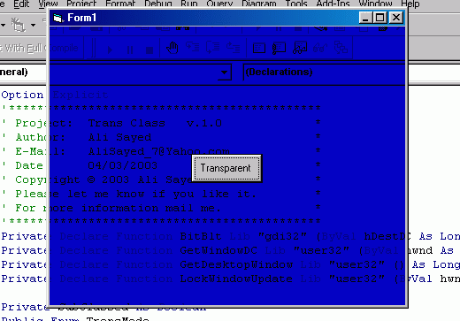



## transparent forms

### Description

transparent forms on windows98
 
### More Info
 

             |
---                |---
**Submitted On**   |2003-03-04 16:42:04
**By**             |[Ali Sayed](https://github.com/Planet-Source-Code/PSCIndex/blob/master/ByAuthor/ali-sayed.md)
**Level**          |Intermediate
**User Rating**    |4.0 (8 globes from 2 users)
**Compatibility**  |VB 5\.0, VB 6\.0
**Category**       |[Custom Controls/ Forms/  Menus](https://github.com/Planet-Source-Code/PSCIndex/blob/master/ByCategory/custom-controls-forms-menus__1-4.md)
**World**          |[Visual Basic](https://github.com/Planet-Source-Code/PSCIndex/blob/master/ByWorld/visual-basic.md)
**Archive File**   |[transparen155438342003\.zip](https://github.com/Planet-Source-Code/ali-sayed-transparent-forms__1-43739/archive/master.zip)

